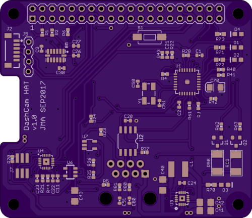
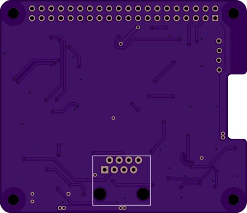

# Dashcam HAT

This repository contains the Eagle PCB design files for a board that
attaches to an ASUS Tinkerboard and provides:
 - Regulated 5V power from OBD-II 12V supply
 - Power management via Attiny
 - OBD-II interface (CAN and ISO9141)
 - 3 axis accelerometer
 - magnetometer
 - GPS

PCB top view:

 

PCB bottom view:

 

